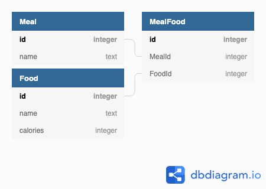

# Quantified Self [](https://travis-ci.com/joequincy/quantified-self-be)
Authored by: [Deonte Cooper](https://github.com/djc00p) and [Jon Peterson](https://github.com/joequincy)

A calorie tracker using JavaScript, built on NodeJS with the [Express](https://expressjs.com/) framework. [Sequelize](http://docs.sequelizejs.com/) is used for an ORM.

This project is a Mod 4 paired assignment from the Turing School of Software and Design. [Assignment details are available](https://github.com/turingschool/backend-curriculum-site/blob/66a39813572f453700ab944948ecf698b0b75d42/module4/projects/quantified_self/qs_server_side.md) in the [@turingschool](https://github.com/turingschool) curriculum repository.

### Setup
From the project root, run:
- `npm install`
- `npx sequelize db:create`
- `npx sequelize db:migrate`
- `npx sequelize db:seed`

To start the API server, run `npm start`, then access endpoints as described below. Default port on `localhost` is `3000`.

### Learning Goals
- Coming from a background learning Rails development, build a NodeJS application utilizing the same principles.
- Create an API using the Express framework, given specified endpoints and response formats (see: [Issues](https://github.com/joequincy/quantified-self-be/issues)).
- As a separate app, create a single-page webapp for the front-end which will interact with the server via the API without page changes or reloads (see: [quantified-self-fe](https://github.com/joequincy/quantified-self-fe)).

### Schema
Because this project utilizes a very simple data set, the database schema is likewise simple.
[](https://dbdiagram.io/d/5d277b1cced98361d6dc9347)

### Endpoints
|         Foods         |         Meals                       |
|-----------------------|-------------------------------------|
|[Index](#foods-index)  |[Index](#meals-index)                |
|[Show](#foods-show)    |[Show](#meals-show)                  |
|[Create](#foods-create)|[Create](#meals-create)              |
|[Update](#foods-update)|-_no update endpoint_-               |
|[Delete](#foods-delete)|[Delete](#meals-delete)              |
|                       |[Add Food](#add-food-to-meal)        |
|                       |[Remove Food](#remove-food-from-meal)|

---

### Foods

#### Foods Index

Returns all foods currently in the database

##### Request

```http
GET /api/v1/foods
```

##### Successful Response

```http
HTTP/1.1 200 OK
```

###### Body
```json
[
  {
    "id": 1,
    "name": "Banana",
    "calories": 150
  },
  {
    "id": 2,
    "name": "Apple",
    "calories": 120
  }
]
```

<details><summary>Failed Responses</summary>

##### Other

```http
HTTP/1.1 500 Internal Server Error
```

###### Body

```js
{"error": "Internal Server Error"}
```

</details>

---

#### Foods Show

Given the ID of a Food object will return that object if it exists.

##### Request

```http
GET /api/v1/foods/:id
```

##### Successful Response

```http
HTTP/1.1 200 OK
```

###### Body

```json
  {
    "id": 1,
    "name": "Banana",
    "calories": 150
  }
```

<details><summary>Failed Responses</summary>

##### Unable to find requested food

```http
HTTP/1.1 404 Not Found
```

###### Body

```js
{"error": "No food found with the provided ID."}
```

##### Other

There are no other anticipated failure states. A failure for any other reason is unexpected and will follow the below format.

```http
HTTP/1.1 500 Internal Server Error
```

###### Body

```js
{"error": "Internal Server Error"}
```

</details>

---

#### Foods Create

Allows creating a new food with both required parameters `name` and `calories`.

##### Request

```http
POST /api/v1/foods
```

```json
{ "food":
  {
    "name": "Strawberry",
    "calories": 6
  }
}
```

##### Successful Response

```http
HTTP/1.1 201 Created
```

###### Body

```json
  {
    "id": 1,
    "name": "Strawberry",
    "calories": 6
  }
```

<details><summary>Failed Responses</summary>

##### Invalid Request Format

```http
HTTP/1.1 400 Bad Request
```

###### Body

```js
{"error": "Invalid request. Please confirm request body matches API specification." }
```

##### Other

There are no other anticipated failure states. A failure for any other reason is unexpected and will follow the below format.

```http
HTTP/1.1 500 Internal Server Error
```

###### Body

```js
{"error": "Internal Server Error"}
```

</details>

---

#### Foods Update

Allows a food with both required parameters `name` and `calories` to be updated.

##### Request

```http
PATCH /api/v1/foods/1
```

```json
{ "food":
  {
    "name": "Grape",
    "calories": 10
  }
}
```

##### Successful Response

```http
HTTP/1.1 200 OK
```

###### Body

```json
  {
    "id": 1,
    "name": "Grape",
    "calories": 10
  }
```

<details><summary>Failed Responses</summary>

##### Invalid Request Format

```http
HTTP/1.1 400 Bad Request
```

###### Body

```js
{"error": "Invalid request. Please confirm request body matches API specification." }
```

##### Other

There are no other anticipated failure states. A failure for any other reason is unexpected and will follow the below format.

```http
HTTP/1.1 500 Internal Server Error
```

###### Body

```js
{"error": "Internal Server Error"}
```

</details>

---

#### Foods Delete

Allows a food with both required parameters `name` and `calories` to be updated.

##### Request

```http
PATCH /api/v1/foods/1
```

##### Successful Response

```http
HTTP/1.1 204 No Content
```

<details><summary>Failed Responses</summary>

##### Unable to find requested food

```http
HTTP/1.1 404 Not Found
```

###### Body

```js
{"error": "No food found with provided ID." }
```

##### Other

There are no other anticipated failure states. A failure for any other reason is unexpected and will follow the below format.

```http
HTTP/1.1 500 Internal Server Error
```

###### Body

```js
{"error": "Internal Server Error"}
```

</details>

---

### Meals

#### Meals Index

Returns all meals currently in the database, as well as their associated foods.

##### Request

```http
GET /api/v1/meals
```

##### Successful Response

A collection of Meal objects, each containing a collection of Food objects.

```http
HTTP/1.1 200 OK
```

###### Body
```js
[
  {
    "id": 1,
    "name": "Breakfast",
    "foods": [
      {
        "id": 1,
        "name": "Banana",
        "calories": 150
      },
      {
        "id": 6,
        "name": "Yogurt",
        "calories": 550
      }
    ]
  },
  {
    "id": 2,
    "name": "Snack",
    "foods": [
      {
        "id": 1,
        "name": "Banana",
        "calories": 150
      },
      {
        "id": 9,
        "name": "Gum",
        "calories": 50
      }
    ]
  }
]
```

<details><summary>Failed Responses</summary>

##### Other

There are no anticipated failure states. Any failures are unexpected and will follow the below format.

```http
HTTP/1.1 500 Internal Server Error
```

###### Body

```js
{"error": "Internal Server Error"}
```

</details>

---

#### Meals Show

Given the ID of a meal, the requested meal as well as its associated foods.

##### Requirements

- Provided ID must match a meal that exists in the database.

##### Request

```http
GET /api/v1/meals/:id
```

##### Successful Response

A Meal object containing a collection of its associated Food objects.

```http
HTTP/1.1 200 OK
```

###### Body
```js
{
  "id": 1,
  "name": "Breakfast",
  "foods": [
    {
      "id": 1,
      "name": "Banana",
      "calories": 150
    },
    {
      "id": 6,
      "name": "Yogurt",
      "calories": 550
    }
  ]
}
```

<details><summary>Failed Responses</summary>

##### Unable to find requested meal

This error will be returned when the requested ID does not match a Meal in the database.

```http
HTTP/1.1 404 Not Found
```

###### Body

```js
{"error": "No meal found with the provided ID."}
```

##### Other

There are no other anticipated failure states. A failure for any other reason is unexpected and will follow the below format.

```http
HTTP/1.1 500 Internal Server Error
```

###### Body

```js
{"error": "Internal Server Error"}
```

</details>

---

#### Meals Create

Allows creating a new meal with required parameter `name`.

##### Request

```http
POST /api/v1/meals
```

```json
{ "meal":
  {
    "name": "Breakfast"
  }
}
```

##### Successful Response

```http
HTTP/1.1 201 Created
```

###### Body

```json
  {
    "id": 1,
    "name": "Breakfast"
  }
```

<details><summary>Failed Responses</summary>

##### Invalid Request Format

```http
HTTP/1.1 400 Bad Request
```

###### Body

```js
{"error": "Invalid request. Please confirm request body matches API specification." }
```

##### Other

There are no other anticipated failure states. A failure for any other reason is unexpected and will follow the below format.

```http
HTTP/1.1 500 Internal Server Error
```

###### Body

```js
{"error": "Internal Server Error"}
```

</details>

---

#### Add Food to Meal

Given the ID of a meal and the ID of a food, add the food to foods in the meal.

##### Requirements

- Provided meal ID must match a meal that exists in the database.
- Provided food ID must match a food that exists in the database.

##### Request

```http
POST /api/v1/meals/:meal_id/foods/:id
```

##### Successful Response

A message indicating that the food was added to the meal successfully.

```http
HTTP/1.1 201 Created
```

###### Body

```js
{
  "message": "Successfully added <Food name> to <Meal name>"
}
```

<details><summary>Failed Responses</summary>

##### Unable to find requested meal

This error will be returned when the requested ID does not match a Meal in the database.

```http
HTTP/1.1 404 Not Found
```

###### Body

```js
{"error": "No meal found with the provided ID."}
```

##### Unable to find requested food

This error will be returned when the requested ID does not match a Food in the database.

```http
HTTP/1.1 404 Not Found
```

###### Body

```js
{"error": "No food found with the provided ID."}
```

##### Other

There are no other anticipated failure states. A failure for any other reason is unexpected and will follow the below format.

```http
HTTP/1.1 500 Internal Server Error
```

###### Body

```js
{"error": "Internal Server Error"}
```

</details>

---

#### Remove Food from Meal

Given the ID of a meal and the ID of a food, remove the food from the meal.

##### Requirements

- Provided meal ID must match a meal that exists in the database.
- Provided food ID must match a food that exists in the database.

##### Request

```http
DELETE /api/v1/meals/:meal_id/foods/:id
```

##### Successful Response

A message indicating that the food was removed from the meal successfully.

```http
HTTP/1.1 204 No Content
```

<details><summary>Failed Responses</summary>

##### Unable to find requested meal

This error will be returned when the requested ID does not match a Meal in the database.

```http
HTTP/1.1 404 Not Found
```

###### Body

```js
{"error": "No meal found with the provided ID."}
```

##### Unable to find requested food

This error will be returned when the requested ID does not match a Food in the database.

```http
HTTP/1.1 404 Not Found
```

###### Body

```js
{"error": "No food found with the provided ID."}
```

##### Other

There are no other anticipated failure states. A failure for any other reason is unexpected and will follow the below format.

```http
HTTP/1.1 500 Internal Server Error
```

###### Body

```js
{"error": "Internal Server Error"}
```

</details>

---

#### Delete Meal

Given the ID of a meal, delete the meal from the database.

##### Requirements

- Provided meal ID must match a meal that exists in the database.

##### Request

```http
DELETE /api/v1/meals/:meal_id
```

##### Successful Response

A message indicating that the meal was deleted successfully.

```http
HTTP/1.1 204 No Content
```

<details><summary>Failed Responses</summary>

##### Unable to find requested meal

This error will be returned when the requested ID does not match a Meal in the database.

```http
HTTP/1.1 404 Not Found
```

###### Body

```js
{"error": "No meal found with the provided ID."}
```

##### Other

There are no other anticipated failure states. A failure for any other reason is unexpected and will follow the below format.

```http
HTTP/1.1 500 Internal Server Error
```

###### Body

```js
{"error": "Internal Server Error"}
```

</details>
